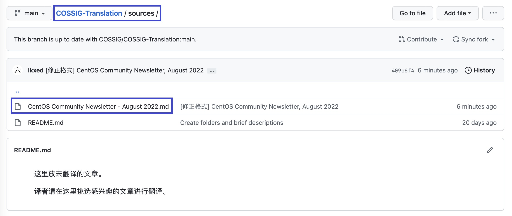
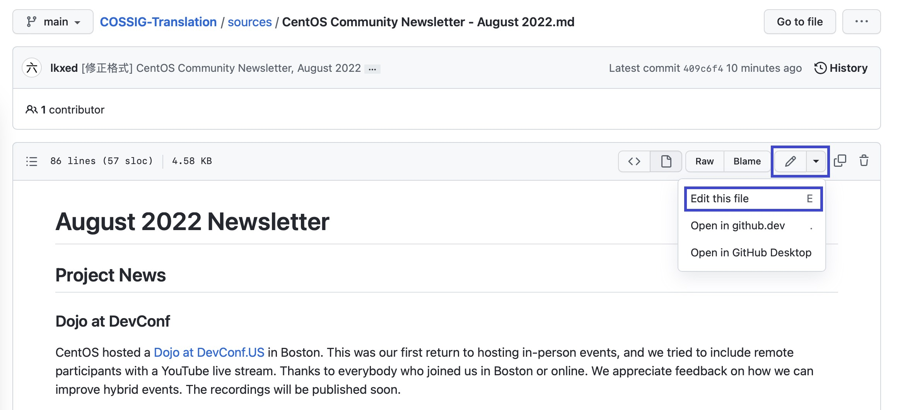
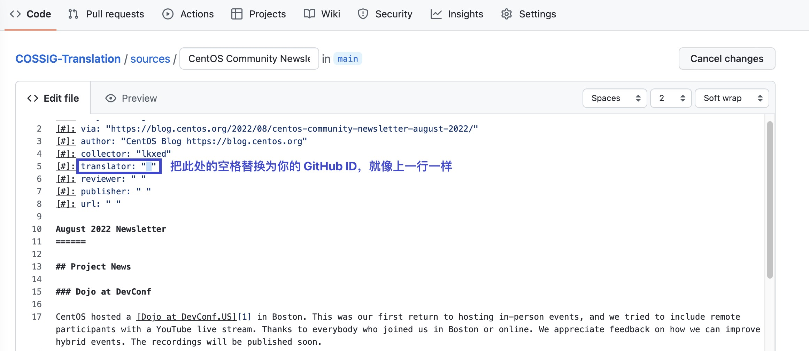
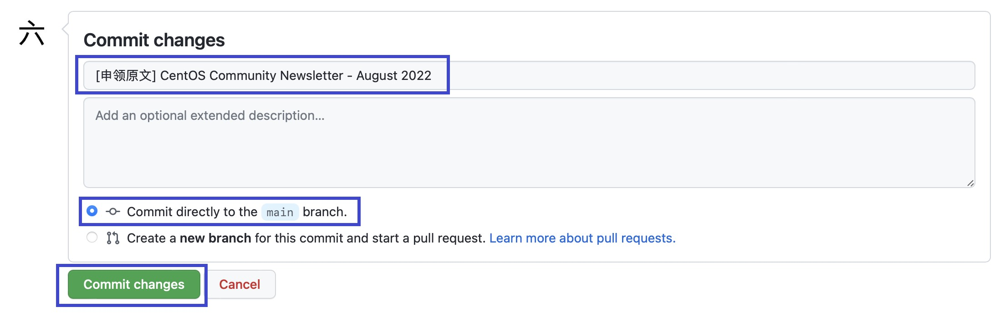
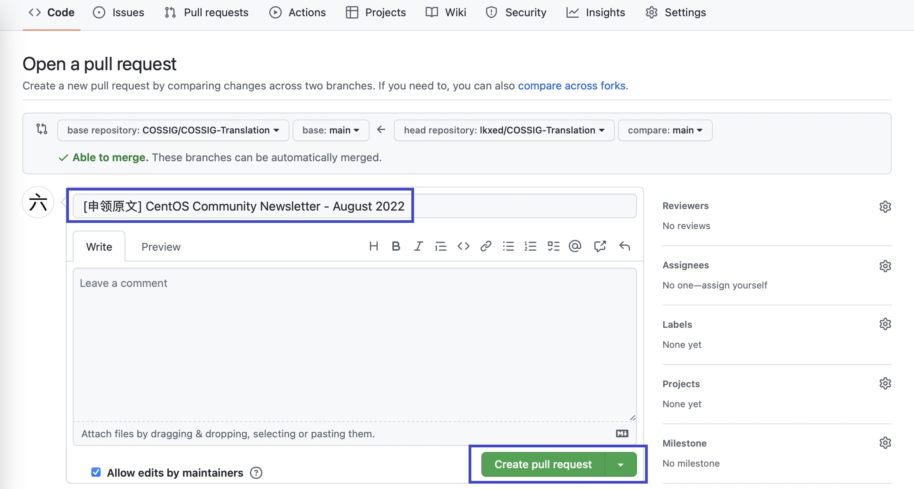
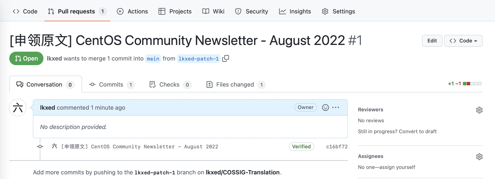
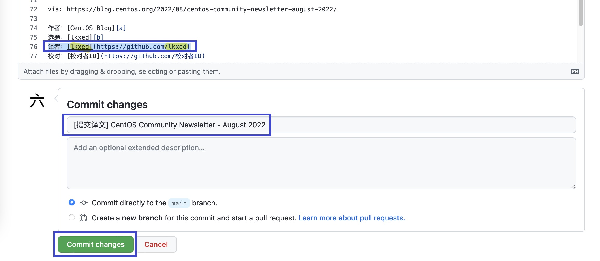
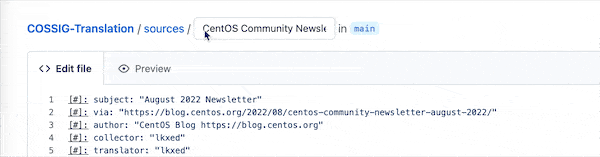

# 使用 GitHub Web

## 前置条件

1. 一个现代浏览器，如 Firefox、Chrome、Edge、Safari 等。
2. 一个 GitHub 账号（[申请](https://github.com/signup)）。

## 流程简介

在所有的工作流程中，翻译是步骤最多的一个，译者也是人数最多的。因此，此处只介绍翻译流程的详细操作步骤。其他流程的操作步骤大同小异，阅读完本节后，结合相应的 [工作流程](../index.md#工作流程) 操作即可。

1. [复刻仓库](#复刻仓库) 或 [同步上游](#同步上游)
2. [申领原文](#申领原文)
3. [在线翻译](#在线翻译)
4. [提交译文](#提交译文)
5. [修改译文](#修改译文)

## 复刻仓库

注意：此步骤仅为**初次翻译**而准备。

进入 COSSIG-Translation 的仓库主页：[https://github.com/COSSIG/COSSIG-Translation](https://github.com/COSSIG/COSSIG-Translation)，点击右上角的 _Fork_ 按钮将仓库复刻到自己名下。

在跳转的新页面中，点击下方的 _Create fork_ 按钮，确认复刻。

成功后，你就有一个自己的 COSSIG-Translation 仓库了，并且它此时与上游仓库（COSSIG/COSSIG-Translation）完全一致。

在这个仓库，你可以进行任何操作。在遇到棘手的问题时，你甚至可以删除掉自己的仓库，重新复刻（如果你有任何需要保留的修改，请另行备份）。

## 同步上游

注意：此步骤仅为**再次翻译**而准备。

进入 COSSIG-Translation 的仓库主页：[https://github.com/COSSIG/COSSIG-Translation](https://github.com/COSSIG/COSSIG-Translation)，观察文件列表上方的小提示。如果它显示 _This branch is up to date with COSSIG/COSSIG-Translation:main._，说明仓库当前已经与上游一致，无需同步。

然而，如果它显示 _This branch is X commits behind COSSIG:main_，则说明仓库当前未与上游保持同步，我们需要手动执行同步操作。

点击小提示右边的 _Sync fork_ 按钮，页面弹出一个小框，再次提醒我们 _This branch is out-of-date_。于是，我们点击下方的 _Update branch_ 按钮。

等待几秒，页面刷新，小提示内容变为 _This branch is up to date with COSSIG/COSSIG-Translation:main._，同步成功。

## 申领原文

在 `sources` 目录下存放着所有未被翻译（或正在被翻译，但未完成）的原文。选择你感兴趣的一篇，点击它，进入它的预览页面。

在原文的右上方，有一个编辑按钮，它的图标是一支铅笔。点击它，或按下键盘上的 <kbd>E</kbd> 键就可以进入到它的编辑页面。

在原文头部的 `translator: " "` 中填入你的 GitHub ID，以此来表明这篇文章将由你来翻译。

然后，滚动到页面底部，你会看到一个提交表单，表单名为 _Commit changes_。在第一行填上 `[申领原文] _文章的名字_`。第二行不是必填项。

接着，选择你要提交到的分支，选择第一项即可。

不过，我们建议，当你要新申请翻译一篇文章时，新建一个分支来进行工作，这是一个很好的实践。

最后，点击绿色的 _Commit changes_ 按钮，完成变更提交。

回到你的仓库主页，此时你会看到 GitHub 提示 _This branch is 1 commit ahead of COSSIG:main_，点击右边的 _Contribute_ 按钮，接着点击绿色的 _Open pull request_ 按钮，发起一个 PR。

类似地，在表单的第一行，也就是头像右边的那一行，GitHub 会根据你之前的提交生成一个标题，如果没有自动生成，仍然是填上 `[申领原文] _文章的名字_`。

同样，下方的 comment 也不是必填项。不过，如果你有和文章相关的信息，可以填在里面。比如，你对这篇文章有什么看法、你觉得翻译上有什么困难、你看过的类似的文章、你的预计翻译完成时间等。

填好后，点击下方绿色的 _Create pull request_ 按钮。

点击后，页面会跳转到你刚创建的 PR，状态是 _Open_。

至此，你的申领原文操作就完成了！接下来，项目的管理者会审核、合并你的 PR。等到 PR 合并，你就可以开始愉快地翻译啦！（如果比较着急，可以在 QQ 群里 @六开箱。）

## 在线翻译

选择你要翻译的文章，点击右上角带有铅笔图标的编辑按钮，或按下键盘上的 <kbd>E</kbd> 键，进入编辑界面。

然后就是最重要的翻译过程了，直接在编辑框内翻译即可。

我的建议是，在原文段落下另起一行，然后一段段地对照翻译，翻译完成后删除原文段落。

翻译完成后，将文章底部的两处 `译者ID` 替换为你的 GitHub ID。然后，在下方提交信息栏的第一行输入 `[提交译文] _文章的名称_`。请**先不要**点击下方绿色的 _Commit changes_ 按钮！还有一步没有完成！

你还需要把翻译完成的文章从 `sources` 目录移动到 `translated` 目录。怎么做呢？

1. 光标移动到最上方的文件名编辑框。
2. 按下键盘上的退格键（<kbd>Backspace</kbd>），你会发现 `sources` 跑到了编辑框内，继续按退格键，直至将 `sources` 删除。
3. 在编辑框内输入 `translated`，最后输入 `/`，你会发现 `translated` 跑出了编辑框，变成了路径的一部分。
4. 点击任意区域即可。

最后，滚动到页面最下方，点击绿色的 _Commit changes_ 按钮，提交修改。

回到你的仓库主页，与 [申领原文](#申领原文) 同样的流程，发起一个 PR，等待 PR 通过即可。
