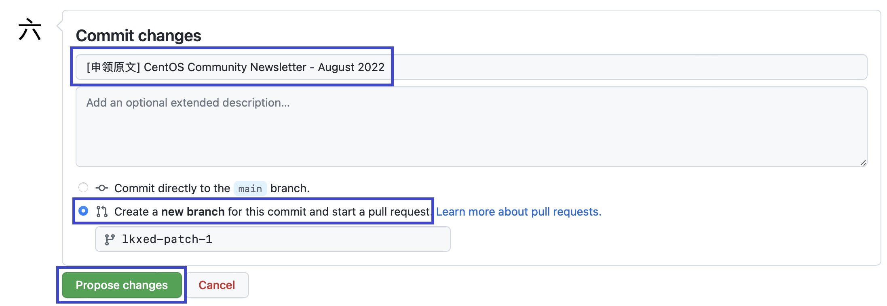
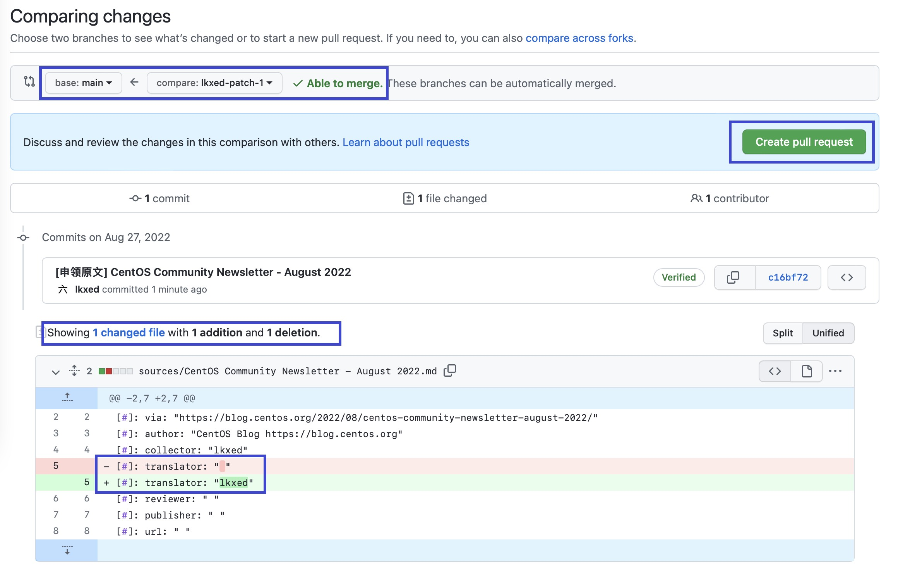

# 使用 GitHub Web

## 前置条件

1. 一个现代浏览器，如 Firefox、Chrome、Edge、Safari 等。
2. 一个 GitHub 账号（[申请](https://github.com/signup)）。

## 流程简介

在所有的工作流程中，翻译是步骤最多的一个，译者也是人数最多的。因此，此处只介绍翻译流程的详细操作步骤。其他流程的操作步骤大同小异，阅读完本节后，结合相应的 [工作流程](../index.md#工作流程) 操作即可。

1. [复刻仓库](#复刻仓库) 或 [同步上游](#同步上游)
2. [申领原文](#申领原文)
3. [提交译文](#提交译文)
4. [修改译文](#修改译文)

## 复刻仓库

注意：此步骤仅为**初次翻译**而准备。

进入 COSSIG-Translation 的仓库主页：[https://github.com/COSSIG/COSSIG-Translation](https://github.com/COSSIG/COSSIG-Translation)，点击右上角的 _Fork_ 按钮将仓库复刻到自己名下。

在跳转的新页面中，点击下方的 _Create fork_ 按钮，确认复刻。

成功后，你就有一个自己的 COSSIG-Translation 仓库了，并且它此时与上游仓库（COSSIG/COSSIG-Translation）完全一致。

在这个仓库，你可以进行任何操作。在遇到棘手的问题时，你甚至可以删除掉自己的仓库，重新复刻（如果你有任何需要保留的修改，请另行备份）。

## 同步上游

注意：此步骤仅为**再次翻译**而准备。

进入 COSSIG-Translation 的仓库主页：[https://github.com/COSSIG/COSSIG-Translation](https://github.com/COSSIG/COSSIG-Translation)，观察文件列表上方的小提示。如果它显示 _This branch is up to date with COSSIG/COSSIG-Translation:main._，说明仓库当前已经与上游一致，无需同步。

然而，如果它显示 _This branch is X commits behind COSSIG:main_，则说明仓库当前未与上游保持同步，我们需要手动执行同步操作。

点击小提示右边的 _Sync fork_ 按钮，页面弹出一个小框，再次提醒我们 _This branch is out-of-date_。于是，我们点击下方的 _Update branch_ 按钮。

等待几秒，页面刷新，小提示内容变为 _This branch is up to date with COSSIG/COSSIG-Translation:main._，同步成功。

## 申领原文

在 `sources` 目录下存放着所有未被翻译（或正在被翻译，但未完成）的原文。选择你感兴趣的一篇，点击它，进入它的预览页面。

在原文的右上方，有一个编辑按钮，它的图标是一支铅笔。点击它，或按下键盘上的 <kbd>E</kbd> 键就可以进入到它的编辑页面。

在原文头部的 `translator: " "` 中填入你的 GitHub ID，以此来表明这篇文章将由你来翻译。

然后，滚动到页面底部，你会看到一个提交表单，表单名为 _Commit changes_。在第一行填上 `[申领原文] _文章的名字_`。第二行不是必填项。

接着，选择你要提交到的分支，我们建议选择第二个，也就是为这个修改创建一个新分支，并发起一个 PR。当你要新申请翻译一篇文章时，新建一个分支来进行工作，这是一个很好的实践。

最后，点击绿色的 _Propose changes_ 按钮，开启一个变更预览页面。

变更预览是为了让你确认当前所做的所有变更，并告诉你是否可以进行合并操作。

GitHub 给你提供了关于你本次变更的信息。例如，你想要主分支（main）从哪个分支（lkxed-patch-1）拉取变更，是否可以合并（有无冲突），变更了哪些文件，每个文件做了哪些变更。

当你确认了变更后，点击右边绿色的 _Create pull request_ 按钮，发起一个 PR。

类似地，在表单的第一行，也就是头像右边的那一行，GitHub 会根据你之前的提交生成一个标题，如果没有自动生成，仍然是填上 `[申领原文] _文章的名字_`。

同样，下方的 comment 也不是必填项。不过，如果你有和文章相关的信息，可以填在里面。比如，你对这篇文章有什么看法、你觉得翻译上有什么困难、你看过的类似的文章、你的预计翻译完成时间等。

填好后，点击下方绿色的 _Create pull request_ 按钮。

至此，你的申领原文操作就完成了！接下来，项目的管理者会审核、合并你的 PR。等到 PR 合并，你就可以开始愉快地翻译啦！（如果比较着急，可以在 QQ 群里 @六开箱。）
