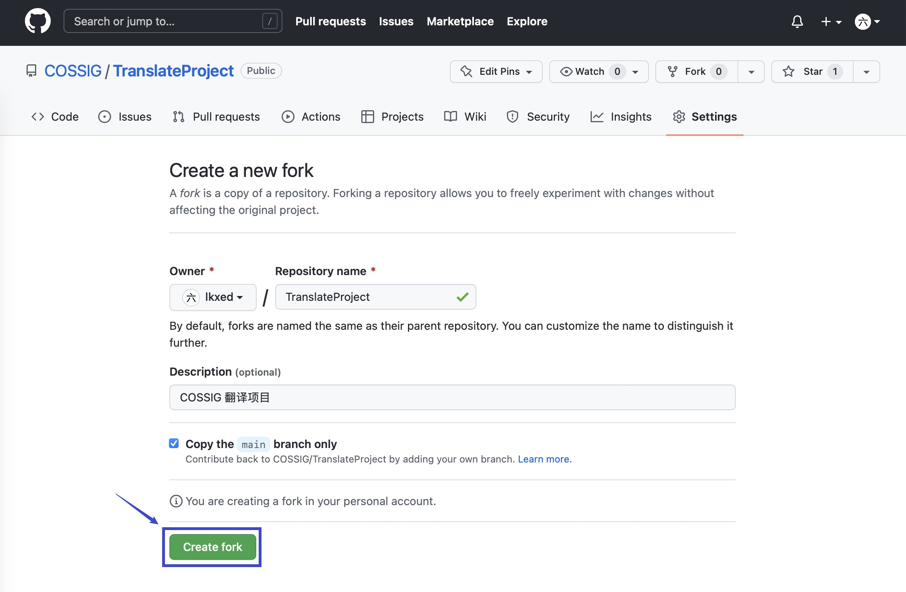
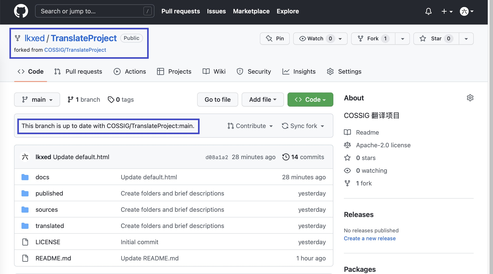
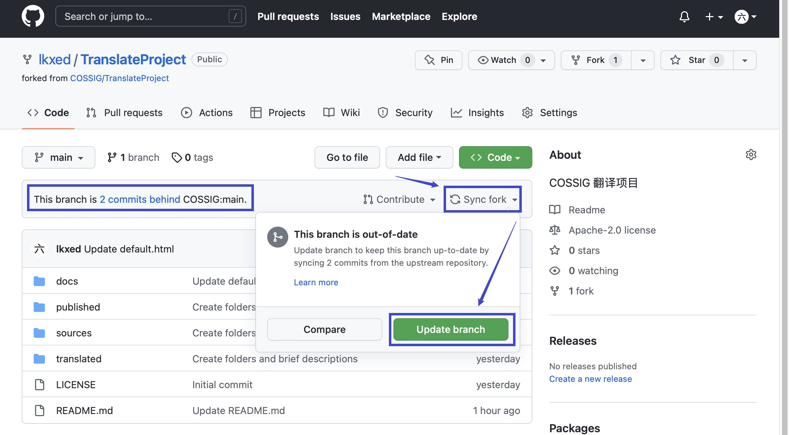

# 使用 GitHub Web

## 前置条件

1. 一个现代浏览器，如 Firefox、Chrome、Edge、Safari 等。
2. 一个 GitHub 账号（[申请](https://github.com/signup)）。

## 流程简介

在所有的工作流程中，翻译是步骤最多的一个，译者也是人数最多的。因此，此处只介绍翻译流程的详细操作步骤。其他流程的操作步骤大同小异，阅读完本节后，结合相应的 [工作流程](../index.md#工作流程) 操作即可。

1. [复刻仓库](#复刻仓库) 或 [同步上游](#同步上游)
2. [申领原文](#申领原文)
3. [提交译文](#提交译文)
4. [修改译文](#修改译文)

## 复刻仓库

注意：此步骤仅为**初次翻译**而准备。

进入 TranslateProject 的仓库主页：[https://github.com/COSSIG/TranslateProject](https://github.com/COSSIG/TranslateProject)，点击右上角的 _Fork_ 按钮将仓库复刻到自己名下。

在跳转的新页面中，点击下方的 _Create fork_ 按钮，确认复刻。

成功后，你就有一个自己的 TranslateProject 仓库了，并且它此时与上游仓库（COSSIG/TranslateProject）完全一致。

在这个仓库，你可以进行任何操作。在遇到棘手的问题时，你甚至可以删除掉自己的仓库，重新复刻（如果你有任何需要保留的修改，请另行备份）。

## 同步上游

注意：此步骤仅为**再次翻译**而准备。

进入 TranslateProject 的仓库主页：[https://github.com/COSSIG/TranslateProject](https://github.com/COSSIG/TranslateProject)，观察文件列表上方的小提示。如果它显示 _This branch is up to date with COSSIG/TranslateProject:main._，说明仓库当前已经与上游一致，无需同步。

然而，如果它显示 _This branch is X commits behind COSSIG:main_，则说明仓库当前未与上游保持同步，我们需要手动执行同步操作。

点击小提示右边的 _Sync fork_ 按钮，页面弹出一个小框，再次提醒我们 _This branch is out-of-date_。于是，我们点击下方的 _Update branch_ 按钮。

等待几秒，页面刷新，小提示内容变为 _This branch is up to date with COSSIG/TranslateProject:main._，同步成功。

## 申领原文

在 `sources` 目录下存放着所有未被翻译（或正在被翻译，但未完成）的原文。选择你感兴趣的一篇，点击它，进入它的预览页面。

在原文的右上方，有一个编辑按钮，它的图标是一支铅笔。点击它，或按下键盘上的 <kbd>E</kbd> 键就可以进入到它的编辑页面。